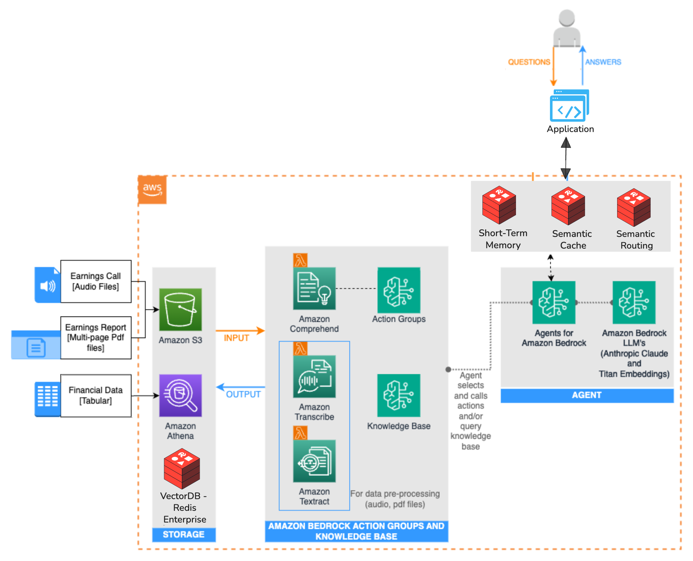

# Redis-Enhanced AWS Bedrock Agent

A side-by-side architecture comparison demonstrating Redis Enterprise performance optimizations for AWS Bedrock Agents.

## Background

Financial organizations work with complex data from many sources like market feeds, economic indicators, news, social media, and risk assessments. This scattered, unstructured data creates operational overhead and requires complex transformation logic that increases costs and complexity.

Multi-modal AI agents solve these problems by processing different data types and connecting insights across them. In financial markets, these agents help with automated reporting, forecasting, and compliance monitoring. This dramatically improves analyst productivity by handling routine tasks and speeding up research workflows.

This demo shows how Redis Enterprise enhances AWS Bedrock agents with semantic caching, conversation memory, and intelligent routing to enable fast responses for critical financial applications while reducing LLM  costs through intelligent caching.



## Code Structure

```
├── app.py                 # FastAPI app
├── config.py              # Config management
├── redis_integration.py   # Redis Enterprise features
├── bedrock_service.py     # AWS Bedrock abstraction
├── index.html             # Comparison UI
├── setup.sh               # Environment setup
└── certs/                 # Redis TLS certificates
```

## Prerequisites

- Python 3.8+
- AWS Account with Bedrock enabled
- Redis Enterprise Cloud account

## Installation

```bash
git clone https://github.com/Redislabs-Solution-Architects/redis-aws-investment-analyst.git
cd redis-aws-investment-analyst
pip install -r requirements.txt
```

## Setup

### Step 1: AWS Foundation Setup◊
Deploy the baseline AWS architecture using the official sample repository:

[AWS Bedrock Investment Research Sample](https://github.com/aws-samples/amazon-bedrock-samples/tree/main/agents-and-function-calling/bedrock-agents/use-case-examples/ai-powered-assistant-for-investment-research)

This establishes: S3 bucket with financial documents, OpenSearch knowledge base, and a functional Bedrock agent. Record the agent ID for configuration.

### Step 2: Redis Integration

#### 2a. Redis Database
1. Create Redis Enterprise database with Vector Search module and TLS encryption enabled
2. Record connection parameters: host, port, password
3. Download TLS certificates to `certs/` directory with these exact filenames:
   - CA certificate → `certs/redis_ca.pem`
   - Client certificate → `certs/client-cert.pem`
   - Client key → `certs/client-key.pem`

#### 2b. Redis Knowledge Base
1. Create new knowledge base in AWS Bedrock console
2. Configure with identical S3 bucket from Step 1
3. Select Redis as vector database (instead of OpenSearch)
4. Configure Redis connection parameters and TLS certificates
5. Execute knowledge base synchronization

#### 2c. Redis Agent
1. Create new Bedrock agent with identical configuration to OpenSearch agent
2. Associate with Redis knowledge base from Step 2b
3. Record the Redis agent ID for application configuration

### Step 3: Configure Credentials
```bash
cp setup.sh.example setup.sh
chmod +x setup.sh
nano setup.sh  # Fill in your credentials:
```

```bash
# AWS
export AWS_ACCESS_KEY_ID="AKIA..."
export AWS_SECRET_ACCESS_KEY="..."
export AWS_REGION="us-west-2"
export BEDROCK_AGENT_ID_REDIS="your-redis-agent-id"      # From Step 2c
export BEDROCK_AGENT_ID_OPENSEARCH="your-opensearch-agent-id" # From Step 1

# Redis
export REDIS_HOST="redis-12345.c1.us-west-2.ec2.cloud.redislabs.com"
export REDIS_PORT="12345"
export REDIS_PASSWORD="your-password"

# TLS Certificates (required for Bedrock integration)
export REDIS_CA_CERT="./certs/redis_ca.pem"
export REDIS_CLIENT_CERT="./certs/client-cert.pem"
export REDIS_CLIENT_KEY="./certs/client-key.pem"
```

### Step 4: Run
```bash
./setup.sh
```

Access `http://localhost:8000` to interact with both architectures simultaneously and compare performance metrics.


## Configuration

### Performance Tuning
```python
# config.py
SIMILARITY_THRESHOLD = 0.8      # Cache strictness (higher = more strict)
MEMORY_THRESHOLD = 0.15         # Memory recall (lower = more recall)  
CACHE_TTL = 86400              # Cache TTL (seconds)
MEMORY_TTL = 604800            # Memory TTL (seconds)
```

## Test Queries

**Semantic Caching**
```  
- What are the biggest risks facing Amazon inc.?
- What are Amazon's business challenges?
```  

**Short Term Memory:**
```  
- Focus on 2021 financial data
- What were the net sales?
```  

**Semantic Caching**
From the previous question "What were the net sales?"
```  
- what were the sales figures?
```  

**Semantic Routing**
```  
- How do I cook Pasta?
- Can you tell me how to play  Basketball?
```  
